## Вас пригласили настроить мониторинг на проект. На онбординге вам рассказали, что проект представляет из себя платформу для вычислений с выдачей текстовых отчетов, которые сохраняются на диск. Взаимодействие с платформой осуществляется по протоколу http. Также вам отметили, что вычисления загружают ЦПУ. Какой минимальный набор метрик вы выведите в мониторинг и почему?

### Ответ
### Минимальный набор метрик

1. **HTTP-метрики**
    - RPS, latency (p95), статус-коды  
        → позволяют оценить доступность и качество ответа сервиса
2. **CPU**
    - загрузка CPU, load average  
        → система выполняет вычисления, CPU является основным узким местом
3. **Память**
    - использование RAM, swap  
        → контроль утечек и деградации производительности
4. **Диск**
    - заполненность, I/O  
        → отчёты сохраняются на диск, ресурс критичен для работы системы
5. **Метрики выполнения задач**
    - время обработки, размер очереди  
        → отражают фактическую производительность системы
6. **Доступность**
    - healthcheck  
        → базовая проверка работоспособности сервиса  
## Менеджер продукта посмотрев на ваши метрики сказал, что ему непонятно что такое RAM/inodes/CPUla. Также он сказал, что хочет понимать, насколько мы выполняем свои обязанности перед клиентами и какое качество обслуживания. Что вы можете ему предложить?

Предлагается ввести продуктовые метрики на основе SLI/SLO:

1. **Доступность сервиса**
    - SLI: доля успешных HTTP-запросов
    - SLO: 99.5%
2. **Скорость ответа**
    - SLI: p95 latency
    - SLO: < 500 мс
3. **Успешность выполнения задач**
    - SLI: доля успешно сгенерированных отчётов
    - SLO: 99%
4. **Время выполнения задач**
    - SLI: p95 времени генерации отчёта
    - SLO: < N секунд
5. **Задержка в очереди**
    - SLI: время ожидания перед началом выполнения
    - SLO: < X секунд  

 

## Вашей DevOps команде в этом году не выделили финансирование на построение системы сбора логов. Разработчики в свою очередь хотят видеть все ошибки, которые выдают их приложения. Какое решение вы можете предпринять в этой ситуации, чтобы разработчики получали ошибки приложения?

В условиях отсутствия бюджета на полноценную систему логирования целесообразно использовать Zabbix, так как он поддерживает мониторинг логов из коробки.

- Zabbix agent читает `/var/log/app.log`
- ищет `ERROR`
- создаёт событие
- шлёт уведомление разработчикам

## Вы, как опытный SRE, сделали мониторинг, куда вывели отображения выполнения SLA=99% по http кодам ответов. Вычисляете этот параметр по следующей формуле: summ_2xx_requests/summ_all_requests. Данный параметр не поднимается выше 70%, но при этом в вашей системе нет кодов ответа 5xx и 4xx. Где у вас ошибка?

Ошибка заключается в некорректном определении общего числа запросов. В знаменатель попадают не только HTTP-ответы, но и другие события (например, таймауты или незавершённые запросы), из-за чего значение SLA занижается. Заказчик ожидает видеть долю успешных HTTP-ответов, которая при отсутствии 4xx/5xx должна быть близка к 100%.

Для корректного расчёта SLA необходимо учитывать только завершённые HTTP-запросы с валидным статус-кодом. Это достигается использованием access-логов веб-сервера и фильтрацией записей по наличию HTTP status code. Числитель формируется из 2xx ответов, знаменатель — из всех HTTP-ответов. Дополнительно, в более точной модели, таймауты и незавершённые запросы могут учитываться как ошибки.

## Опишите основные плюсы и минусы pull и push систем мониторинга.
#### Pull-модель (сервер сам забирает метрики)

#### Плюсы

**1. Контроль и единообразие сбора**  
Сервер сам опрашивает цели → одинаковый интервал, одинаковые правила.  
→ меньше «грязных» данных.

**2. Простота отладки**  
Если метрика пропала:

- либо таргет недоступен
- либо endpoint не отвечает

→ причинно-следственная связь очевидна.

**3. Автоматическое обнаружение проблем с доступностью**  
Если endpoint не скрейпится → это уже сигнал (target down).

**4. Нет нагрузки на клиенты по отправке**  
Сервисы просто экспонируют `/metrics`, без логики доставки.

---

#### Минусы
**1. Проблемы с NAT / динамическими хостами**  
Сервер должен «достучаться» до всех целей → сложно в:

- облаках
- ephemeral окружениях
- закрытых сетях

**2. Не подходит для короткоживущих задач**  
Если job живёт 5 секунд:

- pull может просто не успеть его опросить

**3. Масштабирование по числу таргетов**  
Много сервисов → много scrape-запросов → нагрузка на сервер мониторинга

#### Push-модель (агенты сами отправляют метрики)

#### Плюсы

**1. Работает через NAT и закрытые сети**  
Агент сам инициирует соединение → идеально для:

- клиентов за firewall
- распределённых систем

**2. Подходит для batch / short-lived jobs**  
Задача отработала → отправила метрику → всё  
→ ничего не теряется

**3. Гибкость отправки**  
Можно:

- буферизовать
- ретраить
- отправлять при событиях

---

#### Минусы

**1. Потеря контроля над данными**  
Клиенты сами решают, что и когда отправлять →  
→ возможна рассинхронизация и «шум»
**2. Сложнее отладка**  
Если метрик нет:

- агент не отправил?
- сеть?
- сервер не принял?

→ больше точек отказа

**3. Нет “естественного” health-check**  
Если агент умер → данных просто нет  
→ не всегда очевидно, это «0» или «поломка»

**4. Риск перегрузки при массовом push**  
Много агентов → могут одновременно заспамить сервер

Pull-модель обеспечивает централизованный контроль, предсказуемость и упрощённую диагностику, однако хуже работает в динамических и изолированных окружениях. Push-модель, напротив, лучше подходит для распределённых и краткоживущих систем, но усложняет контроль качества данных и диагностику проблем. На практике часто используется гибридный подход.

#### Какие из ниже перечисленных систем относятся к push модели, а какие к pull? А может есть гибридные?

- Prometheus
- TICK
- Zabbix
- VictoriaMetrics
- Nagios

#### 1. Prometheus — **Pull (основная модель)**

**Основная модель: PULL**

- Prometheus сам скрейпит `/metrics`

**Но есть PUSH-исключение:**

- Pushgateway (для batch jobs)

Итог: **гибрид (pull-first)**

- базово pull
- ограниченно push через gateway

---

#### 2. TICK Stack — **Push + Pull (гибрид)**

TICK = Telegraf, InfluxDB, Chronograf, Kapacitor

- Telegraf → чаще **push в InfluxDB**
- но может и pull (input plugins)

Итог: **гибрид, но с уклоном в push**
#### 3. Zabbix — **Гибрид (push + pull)**

- passive checks → **pull**
- active checks (agent сам отправляет) → **push**

Итог: **полноценный гибрид**

---

#### 4. VictoriaMetrics — **гибрид (как Prometheus-совместимая)**

VictoriaMetrics:

- умеет принимать Prometheus scrape (pull)
- умеет ingest push через:
    - remote_write
    - ingestion endpoints

Итог: **гибрид, но чаще используется как pull-compatible backend**

#### Nagios — **в основном pull (active checks)**

- классическая модель: сервер опрашивает хосты
- через NRPE/NSClient может быть псевдо-push, но это всё равно контролируемый pull

Итог: **почти чистый pull (с элементами push через агенты)**

#### 7. Склонируйте себе [репозиторий](https://github.com/influxdata/sandbox/tree/master) и запустите TICK-стэк, используя технологии docker и docker-compose.

В виде решения на это упражнение приведите скриншот веб-интерфейса ПО chronograf (`http://localhost:8888`).

P.S.: если при запуске некоторые контейнеры будут падать с ошибкой - проставьте им режим `Z`, например `./data:/var/lib:Z`
### клонирование 
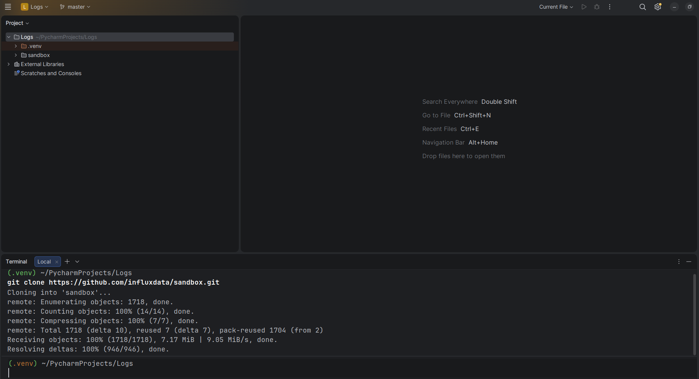

Первый запуск yml файла
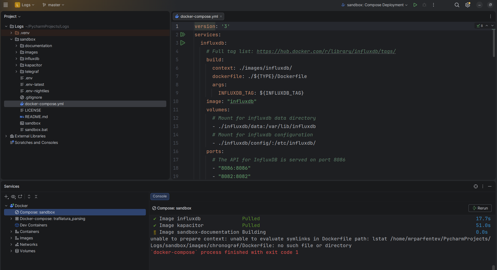

установил build X потом запустил контейнер 
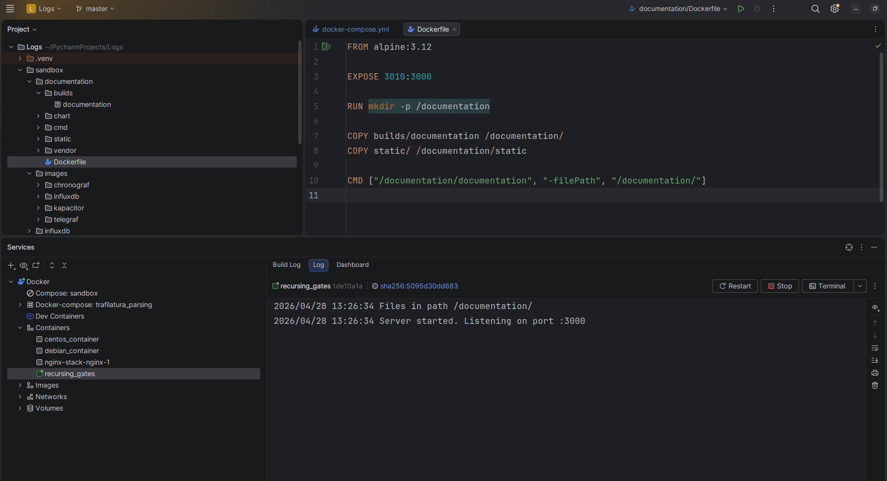

Решил проблему с Хронографом
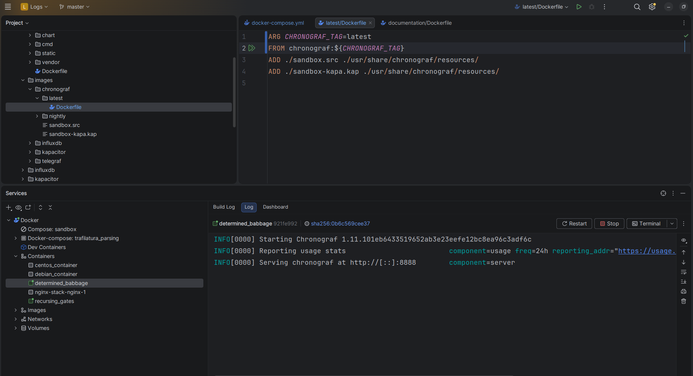

Разбор проблем при запуске TICK-стека

## Несоответствие структуры проекта и docker-compose

Изначально сборка падала из-за того, что `docker-compose.yml` ожидал параметризованную структуру Dockerfile:
dockerfile: ./${TYPE}/Dockerfile
Однако в текущем репозитории не существовало директорий, соответствующих переменной `TYPE` (например `alpine`, `dev` и т.д.). В результате Docker пытался найти несуществующий путь `images/chronograf/Dockerfile`, что приводило к ошибке сборки.

### Решение:
- Убрана зависимость от переменной `TYPE`
- Использован прямой путь к Dockerfile внутри фактической структуры проекта:
dockerfile: Dockerfile

Ошибка пустого аргумента в Dockerfile (chronograf)
ARG CHRONOGRAF_TAG  
FROM chronograf:$CHRONOGRAF_TAG
Так как переменная `CHRONOGRAF_TAG` не передавалась из compose, Docker формировал некорректный образ.

Решение:
ARG CHRONOGRAF_TAG=latest  
FROM chronograf:${CHRONOGRAF_TAG}

После исправления Dockerfile возникала повторная ошибка сборки из-за конфликта:
- одновременно использовались `build:` и `image: chrono_config`
- Docker пытался либо пересобирать образ, либо искать несуществующий в registry

### Решение:
- приведена к одному варианту схема:
    - либо сборка через `build`
    - либо использование уже собранного `image`
- устранено дублирование логики

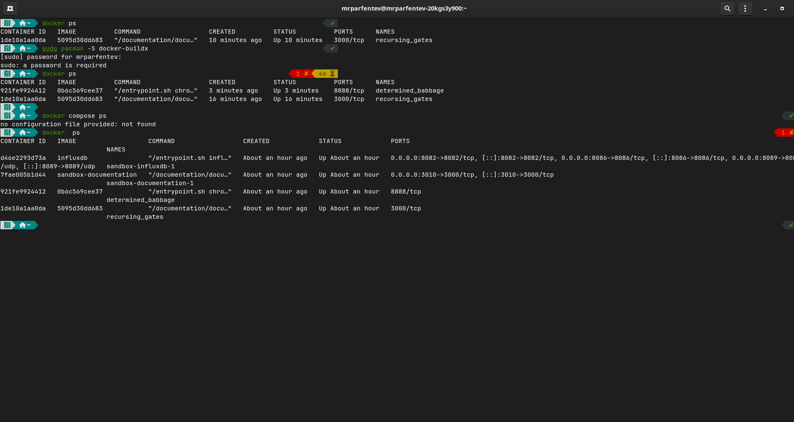

#### ЕЩЕ ПОРТ НЕ ПРОБРОШЕН!
docker run -d --name chronograf \  
-p 8888:8888 \  
chronograf:latest

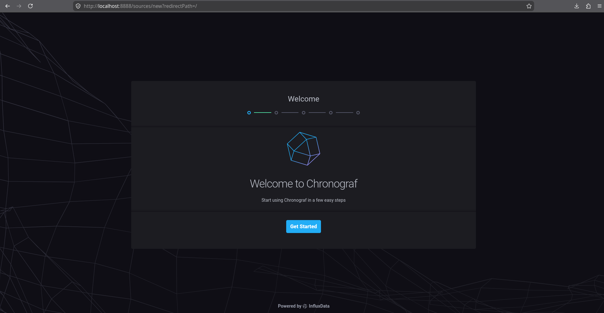

**Важно!** InfluxDB v1.8 требует настройки аутентификации. Если нет пользователей, нужно создать - мне почему-то об нейросетка рассказала, а в задании об этом ничего не сказано.

### переписал Compose 
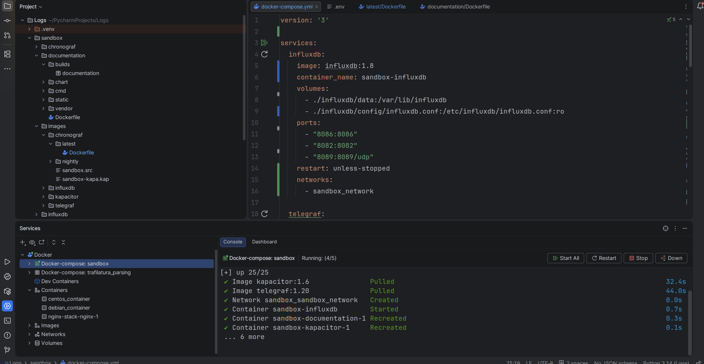

Спустя 2 часа копаний 
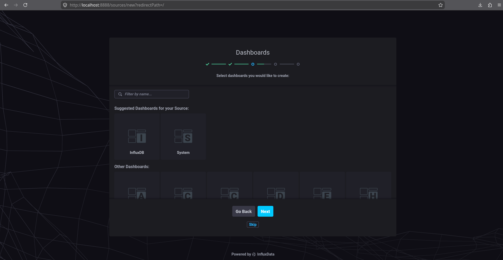

Лучшее что я смог добиться  
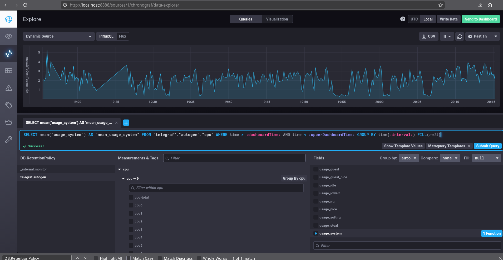
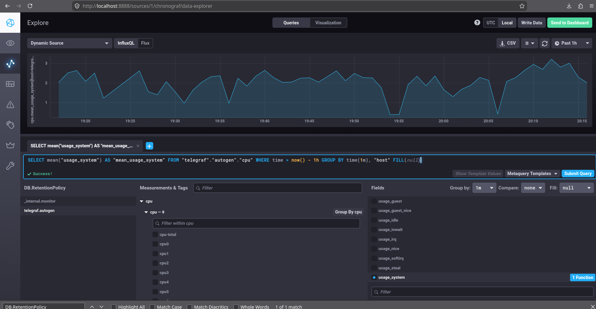
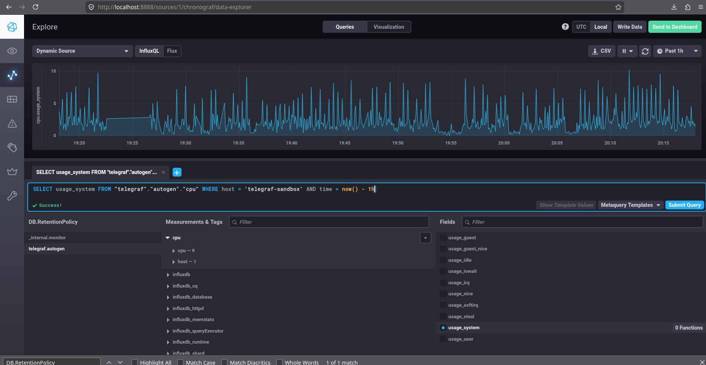
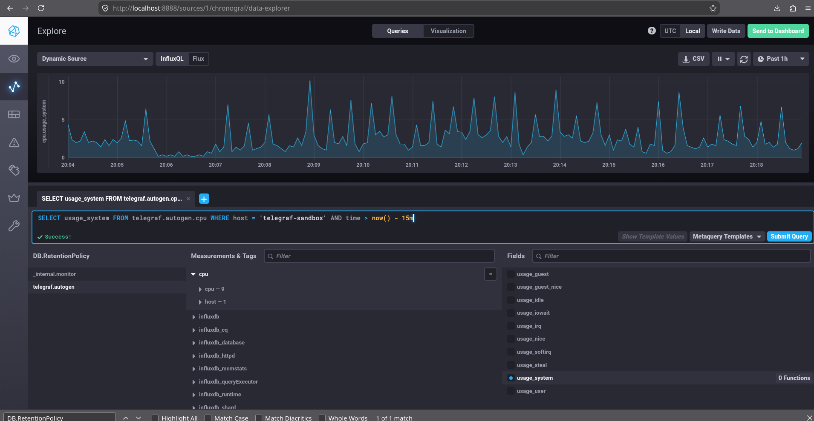
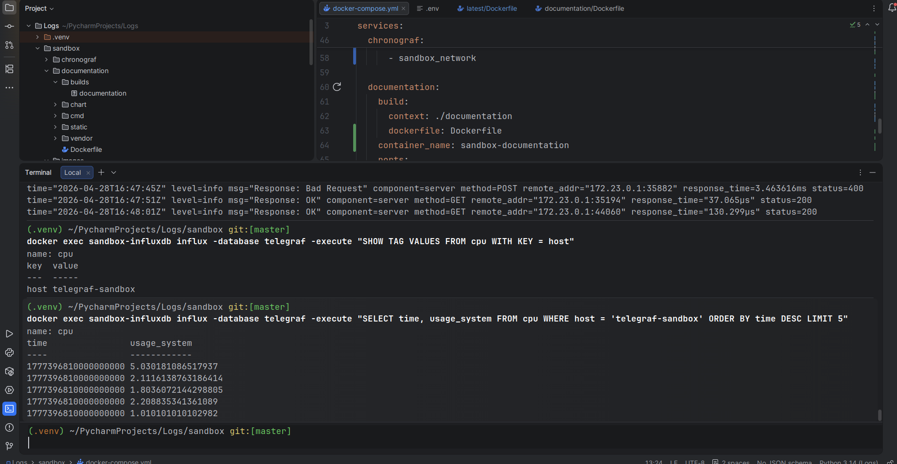

#### Изучите список [telegraf inputs](https://github.com/influxdata/telegraf/tree/master/plugins/inputs). Добавьте в конфигурацию telegraf следующий плагин - [docker](https://github.com/influxdata/telegraf/tree/master/plugins/inputs/docker):  

**конфиги до изменений**
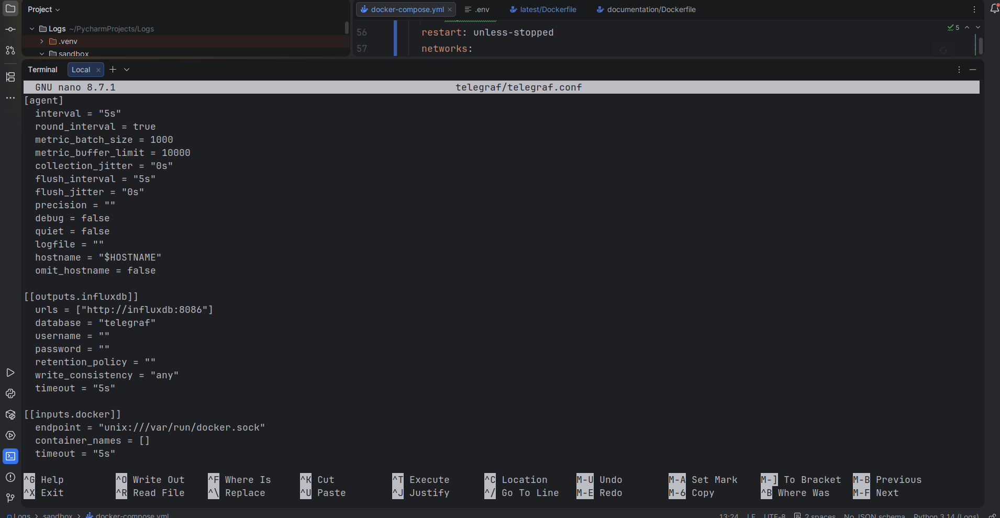

